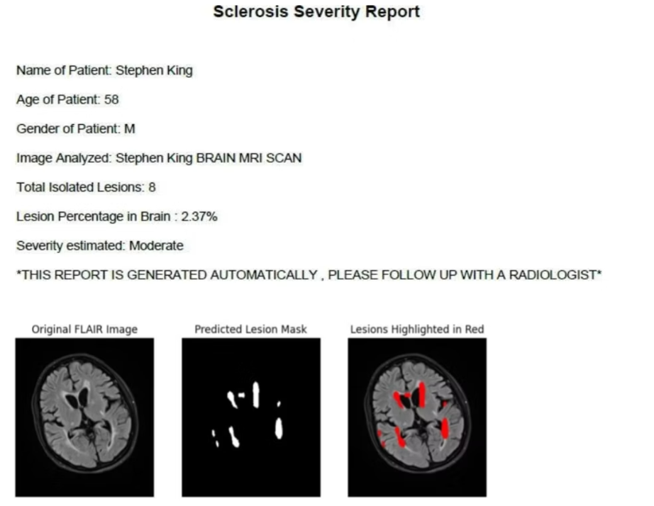

# 🧠 Sclerosis Detection in MRI Data using Deep Learning

This project presents an AI-powered framework for **automated sclerosis detection in MRI scans** using **Fully Convolutional Networks (FCNs)**.  
It aims to improve early diagnosis of **Multiple Sclerosis (MS)** by reducing human error, enhancing diagnostic efficiency, and supporting scalable healthcare solutions.

---

## 🚀 Motivation
- **Rising prevalence of Multiple Sclerosis (MS)** requires faster, more accurate diagnostic tools.
- Manual MRI interpretation is **time-consuming and error-prone**.
- Deep learning enables **automated lesion detection**, improves consistency, and reduces diagnostic delays.

---

## 🎯 Scope
- Develop a **deep learning-based framework** for sclerosis detection in MRI scans.
- Focus on **supervised learning** with annotated datasets.
- Tackle challenges like **data imbalance, noise, and domain shift**.
- Ensure **ethical use, fairness, and data privacy**.
- Future integration into **radiology workflows** and **remote diagnostics**.

---

## 🛠️ Methodology
1. **Data Collection & Preprocessing**  
   - MRI scans sourced from public repositories & anonymized hospital data.  
   - Quality control: intensity normalization, noise reduction, and data augmentation.  

2. **Model Development**  
   - Base models: **FCN-8, U-Net with residual links, Attention-Enhanced FCN**.  
   - Encoders: **VGG16 / ResNet50 pretrained on ImageNet**.  
   - Loss function: **Dice + Binary Cross-Entropy** for handling class imbalance.  
   - Optimizer: **Adam with learning rate scheduling**.  
   - Regularization: **dropout, L2 penalties, early stopping**.  

3. **Evaluation & Visualization**  
   - Metrics: **Accuracy, Dice Coefficient, Specificity, ROC AUC**.  
   - Visualization: Overlay segmentation masks with **OpenCV**.  
   - Interpretability: **Layer-wise Relevance Propagation (LRP)**.  

---

## 📊 Results
- **Accuracy:** 98.98%  
- **Dice Coefficient:** 0.5717 (baseline) → 0.82 (attention-enhanced FCN)  
- **Specificity:** 0.89  
- **ROC AUC:** 0.96  
- **Interpretation Time:** Reduced by 42%  

### 🖼️ Sample Output
Below is an example of sclerosis lesion detection on an MRI scan:

---

## ⚠️ Limitations
- Performance depends on **MRI image quality**.  
- Difficulty distinguishing sclerosis from **other white matter abnormalities**.  
- Domain shift across scanners and protocols affects **generalizability**.  
- High computational requirements for **3D or attention-based models**.  

---

## 🔮 Future Directions
- Real-time MRI analysis and **multi-modal imaging**.  
- Deployment in **low-resource and rural healthcare**.  
- Expansion to other **neurodegenerative diseases**.  
- Hardware optimization for **lightweight deployment**.  

---

## 📚 References
1. Smith, P., & Lee, A. (2019). Enhancing Lesion Detection in MRI Using CNN-Based Models. *IEEE ISBI*.  
2. Wilson, K. (2020). *Medical Imaging Analysis with Deep Learning*. O’Reilly Media.  
3. Li, Y., & Xu, H. (2021). Deep Learning for Brain Lesion Detection in MRI Scans. *Computers & Medical Imaging*.  
4. Zhang, J., & Huang, T. (2020). Medical Imaging Advances Using CNNs. *Journal of Medical Imaging Research*.  
5. Johnson, T., & Patel, R. (2021). Integrating AI for Real-Time Detection of Neurological Disorders. *MIML Conference*.  
6. Goodfellow, I., Bengio, Y., & Courville, A. (2016). *Deep Learning*. MIT Press.  
